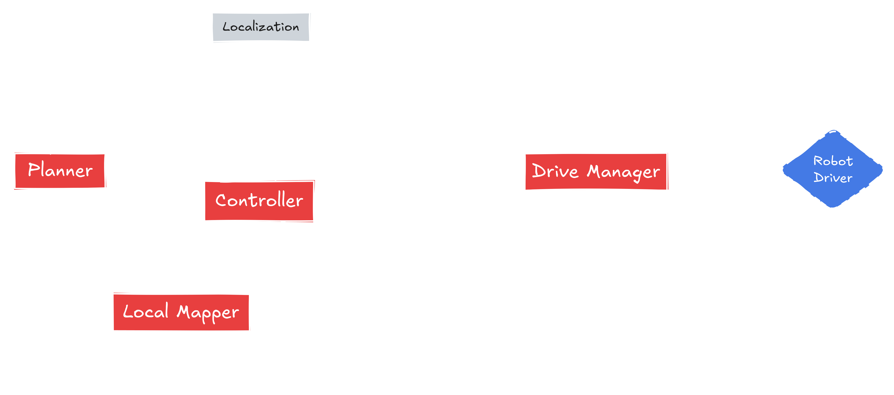

<picture>
  <source media="(prefers-color-scheme: dark)" srcset="_static/Kompass_dark.png">
  <source media="(prefers-color-scheme: light)" srcset="_static/Kompass_light.png">
  
</picture>
<br/>

> 🌐 [English Version](../README.md) | 🇨🇳 [简体中文](README.zh.md)

ようこそ **Kompass** へ！
人類史上最速で直感的なナビゲーションスタックです！
Kompass は自律移動ロボットのための**堅牢**で**イベント駆動型**のナビゲーションスタックを構築するためのフレームワークです。高いカスタマイズ性・拡張性・ハードウェア非依存性を持ち、幅広い用途に対応できる**直感的なPython API**を提供します。

Kompass は、**最新のナビゲーションアルゴリズムをC++でGPU最適化した高速バージョン**を搭載しており、ハードウェアリソースを最大限に活用できます。**マルチスレッドCPU処理**に加え、**NvidiaやAMDなどあらゆるGPU**上での実行が可能で、ベンダーロックインがありません。
そのため、様々なハードウェア構成での開発・運用が可能です。最も重要なのは、**たった1つのPythonスクリプト**で高機能なナビゲーションを構築・導入できるという点です。性能や柔軟性を犠牲にすることはありません。

- Kompassをロボットに[**インストール**](#インストール)する 🛠️
- [**なぜKompassなのか？**](#なぜ-kompass)
- Kompassの[**構成要素**](#構成要素)の概要を見る
- [**クイックスタート**](https://automatika-robotics.github.io/kompass/quick_start.html)で始める 🚀
- [**チュートリアル**](https://automatika-robotics.github.io/kompass/tutorials/point_navigation.html)で深掘りする 🤖
- Kompassの[**設計コンセプト**](https://automatika-robotics.github.io/kompass/advanced/design.html)を学ぶ 📚

# なぜ Kompass？

- **適応型イベント駆動設計**
  Kompassは現実世界のイベント、ロボットの状態変化、タスク更新に応じて柔軟に対応できるよう設計されています。イベント駆動型アーキテクチャにより、イベント-アクションのペアを定義することで、実行中にナビゲーションスタックを再構成したり、環境に応じて計画や制御戦略を切り替えることができます。

- **高速化のためのC++・マルチスレッド・クロスGPU対応**
  すべてのコアアルゴリズムは、モダンなC++で記述されており、高速かつ安全な実行を実現しています（[kompass-core](https://github.com/automatika-robotics/kompass-core)）。Kompass は、主要なナビゲーションコンポーネントのGPUベース実行を明示的にサポートする初のナビゲーションフレームワークです。さらに、GPGPU（汎用GPU計算）サポートを備えており、CPU、GPU、さらにはFPGA上でも高いパフォーマンスを発揮し、従来のフレームワークにありがちな特定ハードウェアベンダーへの依存を打ち破ります。

- **機械学習モデルを第一級の市民として扱う設計**
  Kompassでは、センサーデータやユーザーコマンドを解釈する機械学習モデルの出力によって、外部イベントを駆動できます。これにより、ナビゲーションスタック全体がMLの出力に応じて再構成される可能性を持ちます。これは視覚ナビゲーションを超えた応用を意味します。

- **ネイティブ速度のPythonic API**
  処理の重い部分はC++で実装されつつ、Kompassは直感的なPython APIを提供します。これにより、開発者は迅速にプロトタイプを作成しつつ、本番環境でも高性能なシステムを再実装なしにそのまま導入できます。

- **モジュール式アーキテクチャと簡単な拡張性**
  Kompassは[**Sugarcoat🍬**](https://github.com/automatika-robotics/sugarcoat)上のROS2で構築されており、ROS2インターフェースからコアアルゴリズムを分離しています。これにより、ROS2のバージョン互換性を維持しながら、コアのアップグレードやコミュニティによる拡張が容易になります。

私たちがKompassを開発した[**背景**](https://automatika-robotics.github.io/kompass/why.html)についてもぜひご覧ください。

# 構成要素

Kompassは複数の相互連携するコンポーネントに分かれており、それぞれがナビゲーションの特定のサブタスクを担当します：

<picture>
  <source media="(prefers-color-scheme: dark)" srcset="_static/images/diagrams/system_components_dark.png">
  <source media="(prefers-color-scheme: light)" srcset="_static/images/diagrams/system_components_light.png">
  
</picture>

各コンポーネントはROS2のライフサイクルノードとして実行され、他のコンポーネントとROS2のトピック・サービス・アクションサーバーを介して通信します：

<picture>
  <source media="(prefers-color-scheme: dark)" srcset="_static/images/diagrams/system_graph_dark.png">
  <source media="(prefers-color-scheme: light)" srcset="_static/images/diagrams/system_graph_light.png">
  
</picture>

各コンポーネントの機能や設定方法の詳細は以下のドキュメントをご覧ください：

- [プランナー](https://automatika-robotics.github.io/kompass/navigation/path_planning.html)
- [コントローラー](https://automatika-robotics.github.io/kompass/navigation/control.html)
- [ドライブマネージャー](https://automatika-robotics.github.io/kompass/navigation/driver.html)
- [モーションサーバー](https://automatika-robotics.github.io/kompass/navigation/motion_server.html)

# インストール

## 前提条件

KompassはROS2での利用を前提としています。FoxyからRollingまで、すべてのROS2ディストリビューションをサポートしています。
ROS2のインストールは[公式サイト](https://docs.ros.org/)をご参照ください。

## kompass-coreのインストール

`kompass-core`は、Kompassのための計画・制御アルゴリズムを高度に最適化して提供するPythonパッケージです。以下の方法でインストール可能です：

### GPUサポートあり（推奨）

Ubuntu系システム（Jetpack含む）では、以下を実行してください：

```bash
curl https://raw.githubusercontent.com/automatika-robotics/kompass-core/refs/heads/main/build_dependencies/install_gpu.sh | bash
```

このスクリプトは、[AdaptiveCPP](https://github.com/AdaptiveCpp/AdaptiveCpp) を含むすべての関連依存関係をインストールし、`kompass-core` の最新版をソースからインストールします。事前に[スクリプト](https://github.com/automatika-robotics/kompass-core/blob/main/build_dependencies/install_gpu.sh)の内容を確認することを推奨します。

### pipによるインストール

Ubuntu 22.04以降のバージョンでは、以下のコマンドで依存関係をインストールしてください：

```bash
sudo apt-get install libompl-dev libfcl-dev libpcl-dev
```

その後、以下のようにして kompass-core をインストールします：

```bash
pip install kompass-core
```

## Kompassのインストール（humble および jazzy 以降のディストリビューションに対応）

事前ビルドされたKompassのバイナリは、以下のコマンドでインストールできます：

```bash
sudo apt install ros-$ROS_DISTRO-kompass
```

或者，您也可以从 [发布页面](https://github.com/automatika-robotics/kompass/releases) 下载适用于您喜欢的发行版的 deb 安装包（包括 kompass_interfaces 和 kompass），然后按照以下方式安装：

```bash
sudo dpkg -i ros-$ROS_DISTRO-kompass-interfaces_$version$DISTRO_$ARCHITECTURE.deb
sudo dpkg -i ros-$ROS_DISTRO-kompass_$version$DISTRO_$ARCHITECTURE.deb
```

## ソースからのKompassビルド

以下の手順でKompassをソースからビルドできます：

```bash
mkdir -p kompass_ws/src
cd kompass_ws/src
git clone https://github.com/automatika-robotics/sugarcoat
git clone https://github.com/automatika-robotics/kompass
rosdep update
rosdep install -y --from-paths . --ignore-src
cd ..
colcon build

```

# 著作権

この配布物に含まれるコードは、明記されていない限り、すべて 2024年 Automatika Robotics に著作権があります。

Kompass は MIT ライセンスの下で提供されています。詳細は [LICENSE](../LICENSE) ファイルをご覧ください。

# コミュニティへの貢献

Kompass は、[Automatika Robotics](https://automatikarobotics.com/) と [Inria](https://inria.fr/) の共同開発により作成されました。コミュニティからの貢献も大歓迎です。
