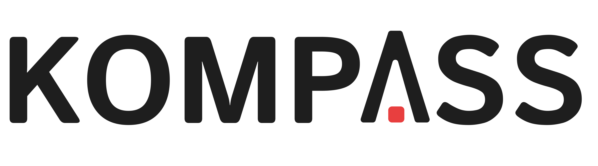

<picture>
  <source media="(prefers-color-scheme: dark)" srcset="docs/_static/Kompass_dark.png">
  <source media="(prefers-color-scheme: light)" srcset="docs/_static/Kompass_light.png">
  
</picture>
<br/>

🇨🇳 [简体中文](docs/README.zh.md) | 🇯🇵 [日本語](docs/README.ja.md)

Welcome to Kompass! The fastest and most intuitive navigation stack known to man! Kompass is a framework for building **robust**, **event-driven** navigation stacks for autonomous mobile robots. Kompass is built to be customizable, extendable and hardware-agnostic. It provides an **intuitive Python API** designed to be easy to integrate, extend, and adapt to a wide range of use cases.

Kompass includes **highly optimized, GPU powered, versions of the most cutting edge navigation algorithms in C++** that make full use of available hardware resources. It supports **multi-threaded execution on CPUs** and can run on **ANY GPU** (Nvidia, AMD, etc.) without vendor lock-in. This makes it suitable for both development and deployment across diverse hardware setups. And most importantly, Kompass makes it straightforward to create and deploy sophisticated navigation capabilities for any mobile robot within **a single Python script**, without sacrificing performance or flexibility.

- [**Install**](#installation) Kompass on your robot 🛠️
- [**Why Kompass?**](#why-kompass)
- See an overview of Kompass [**Components**](#components)
- To get started with Kompass, check the [**quick start**](https://automatika-robotics.github.io/kompass/tutorials/quick_start.html) tutorial 🚀
- Do a deep dive with one of the [**tutorials**](https://automatika-robotics.github.io/kompass/tutorials/point_navigation.html) 🤖
- See [**Benchmarking Results**](#benchmarking-results) 📊
- Learn more about the [**design concepts**](https://automatika-robotics.github.io/kompass/advanced/design.html) of Kompass 📚
- Explore the [**Dynamic Web UI**](#dynamic-web-ui-for-kompass-recipes) for real-time system visualization and control 🖥️
- (**!NEW**) [**Port KOMPASS automation recipes across different robots and hardware**](#using-robot-plugins-for-generic-and-portable-automation-recipes-apps) using **Robot Plugins** 🔌

# Why Kompass?

- **Adaptive Event-Driven Design**: Kompass is built to be responsive to real-world events, robot state changes, and task updates. Its event-driven architecture makes it easy to define event-action pairs to reconfigure the navigation stack during runtime, or to seamlessly switch planning or control strategies based on environment context.

- **Engineered for Speed - C++, Multi-Threading, and Cross-GPU Support**: All core algorithms are written in modern C++ for fast and safe execution ([kompass-core](https://github.com/automatika-robotics/kompass-core)). Kompass is the first navigation framework to explicitly support GPU based execution of primary navigation components. Furthermore its built with GPGPU support, unlocking high performance on any CPUs, GPUs, or even FPGAs, breaking the hardware vendor lock-in of traditional frameworks.

- **Machine learning models as first class citizens**: External events in Kompass can be driven by outputs of machine learning models interpreting sensor data or user commands, which means the entire stack becomes reconfigurable based on ML model outputs. This goes beyond well established scenarios of visual navigation.

- **Pythonic API with Native Speed**: While the heavy lifting is done in optimized C++, Kompass provides an intuitive Python API, letting developers prototype quickly and deploy high-performance systems without rewriting code.

- **Modular architecture and easy extensibility**: Kompass is built on ROS2 using [Sugarcoat🍬](https://github.com/automatika-robotics/sugarcoat). It decouples core algorithms from the ROS2 interface, Kompass ensures compatibility across ROS2 versions and simplifies core upgrades and community extensions.

Find out more about our [**motivation**](https://automatika-robotics.github.io/kompass/why.html) to create Kompass.

# Components

Kompass is divided into several interacting components each responsible for one of the navigation subtasks:

<picture>
  <source media="(prefers-color-scheme: dark)" srcset="docs/_static/images/diagrams/system_components_dark.png">
  <source media="(prefers-color-scheme: light)" srcset="docs/_static/images/diagrams/system_components_light.png">
  
</picture>

Each of the previous components runs as a ROS2 lifecycle node and communicates with the other components using ROS2 topics, services or action servers:

<picture>
  <source media="(prefers-color-scheme: dark)" srcset="docs/_static/images/diagrams/system_graph_dark.png">
  <source media="(prefers-color-scheme: light)" srcset="docs/_static/images/diagrams/system_graph_light.png">
  
</picture>

To learn more about the functionalities and configuration of each component check the component dedicated documentation page:

- [Planner](https://automatika-robotics.github.io/kompass/navigation/path_planning.html)
- [Controller](https://automatika-robotics.github.io/kompass/navigation/control.html)
- [Drive Manager](https://automatika-robotics.github.io/kompass/navigation/driver.html)
- [Motion Server](https://automatika-robotics.github.io/kompass/navigation/motion_server.html)

# Installation

## Prerequisites

Kompass is built to be used with ROS2. All ROS2 distributions starting from _Foxy_ upto _Rolling_ are supported. Install ROS2 version of your choice by following the instructions on the [official site](https://docs.ros.org/).

## Install kompass-core

kompass-core is a python package that provides highly optimized implementations of planning and control algorithms for Kompass. You can install it in the following ways:

### With GPU support (Recommended):

On any Ubuntu (including Jetpack) based machine, you can simply run the following:

```bash
curl -sSL https://raw.githubusercontent.com/automatika-robotics/kompass-core/refs/heads/main/build_dependencies/install_gpu.sh | bash
```

This script will install all relevant dependencies, including [AdaptiveCPP](https://github.com/AdaptiveCpp/AdaptiveCpp) and install the latest version of kompass-core from source. It is good practice to read the [script](https://github.com/automatika-robotics/kompass-core/blob/main/build_dependencies/install_gpu.sh) first.

### Installing with pip

Install kompass-core as follows:

```bash
pip install kompass-core
```

## Install Kompass (available for `humble` and any distribution >= `jazzy` )

Install pre-built Kompass binary as follows:

```bash
sudo apt install ros-$ROS_DISTRO-kompass
```

Alternatively, grab deb packages (for kompass_interfaces and kompass) for your favourite distro from the [release page](https://github.com/automatika-robotics/kompass/releases) and install them as follows:

```bash
sudo dpkg -i ros-$ROS_DISTRO-kompass-interfaces_$version$DISTRO_$ARCHITECTURE.deb
sudo dpkg -i ros-$ROS_DISTRO-kompass_$version$DISTRO_$ARCHITECTURE.deb
```

## Build Kompass from source

You can build Kompass from source as follows:

```shell
mkdir -p kompass_ws/src
cd kompass_ws/src
git clone https://github.com/automatika-robotics/sugarcoat
git clone https://github.com/automatika-robotics/kompass
rosdep update
rosdep install -y --from-paths . --ignore-src
cd ..
colcon build
```

# Benchmarking Results

The plots below visualize the performance differences across platforms for various components of the navigation stack (provided by [`kompass-core`](https://github.com/automatika-robotics/kompass-core)). The **Logarithmic Scale** plot is essential for comparing CPU vs. GPU performance where differences can be orders of magnitude large. See the [benchmarking details](https://github.com/automatika-robotics/kompass-core/blob/main/src/kompass_cpp/benchmarks/README.md) in the core repository for how these plots were generated and what tasks were measured.

### Logarithmic Scale (CPU vs GPU Comparison)

_Note: This chart excludes runs where power monitoring was active to ensure timing accuracy._

<picture>
  <source media="(prefers-color-scheme: dark)" srcset="https://raw.githubusercontent.com/automatika-robotics/kompass-core/main/docs/benchmark_log_dark.png">
  <source media="(prefers-color-scheme: light)" srcset="https://raw.githubusercontent.com/automatika-robotics/kompass-core/main/docs/benchmark_log_light.png">
  
</picture>

### 2. Power Consumption & Efficiency

_Note: Efficiency is calculated as **Operations per Joule** (Throughput / Watts). Higher is better._

<picture>
  <source media="(prefers-color-scheme: dark)" srcset="https://raw.githubusercontent.com/automatika-robotics/kompass-core/main/docs/benchmark_power_dark.png">
  <source media="(prefers-color-scheme: light)" srcset="https://raw.githubusercontent.com/automatika-robotics/kompass-core/main/docs/benchmark_power_light.png">
  
</picture>

# Dynamic Web UI for Kompass Recipes

Leveraging the power of the underlying [**Sugarcoat**](https://github.com/automatika-robotics/sugarcoat) framework, **Kompass** now offers a **fully dynamic, auto-generated Web UI** for every recipe. This feature is built with **FastHTML** and eliminates manual GUI development, instantly providing a responsive interface for control and visualization.

The UI automatically creates:

- Settings interfaces for all the components used in the recipe.
- Real-time data visualizations and controls for component inputs/outputs.


## Example: Point Navigation Recipe UI

An example for an automatically generated UI for a point navigation system, similar to the [quick start example](https://automatika-robotics.github.io/kompass/tutorials/quick_start_webots.html). The UI renders map data, and sends navigation goals to the robot.

<p align="center">
<picture align="center">
  
</picture>
</p>

# Using Robot Plugins for Generic and Portable Automation Recipes (Apps)

Different robots often use custom messages, or services in their ROS2 interfaces to handle basic operations like sending robot actions (Velocity) or getting diverse low-level feedback (Odometry, IMU, etc.). With traditional ROS2 packages, you will need to do code changes to handle each new message/service type. This creates a “lock-in” where your code becomes tightly coupled to a specific robot.

The new Robot Plugins act as a translation layer. It sits between your application and the robot’s hardware with all its custom types. It abstracts away robot-specific ROS2 interfaces, and allows you to write generic, portable automation logic using standard types that runs on any robot without code changes.

- See an introduction to the robot plugins and how to test them in Kompass recipes in [**this video**](https://www.youtube.com/watch?v=oZN6pcJKgfY)
- For a complete guide on how to create and use a robot plugin, [check out the documentations](https://automatika-robotics.github.io/sugarcoat/advanced/robot_plugins.html)

# Copyright

The code in this distribution is Copyright (c) 2024 Automatika Robotics unless explicitly indicated otherwise.

Kompass is made available under the MIT license. Details can be found in the [LICENSE](LICENSE) file.

# Contributions

Kompass has been developed in collaboration between [Automatika Robotics](https://automatikarobotics.com/) and [Inria](https://inria.fr/). Contributions from the community are most welcome.
