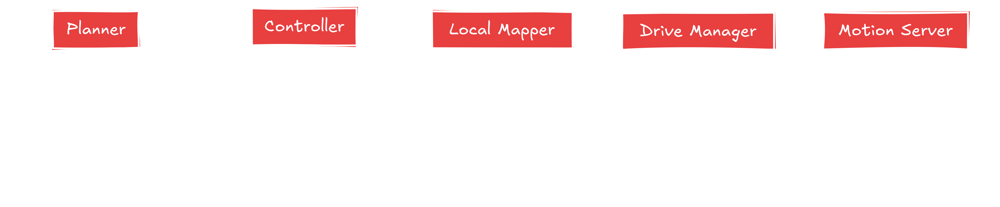

<picture>
  <source media="(prefers-color-scheme: dark)" srcset="docs/_static/Kompass.png">
  <source media="(prefers-color-scheme: light)" srcset="docs/_static/Kompass_dark.png">
  
</picture>

Kompass is an event-driven navigation system designed with an easy-to-use and intuitive Python API. Kompass is built to be customizable, extendable and hardware-agnostic. It aims to implement the most cutting edge algorithms for all parts of the navigation stack. And most importantly, it allows users to create very sophisticated navigation capabilities for autonomous mobile robots, within a single python script.

- Find out more about our [**motivation**](https://automatika-robotics.github.io/kompass/why.html) to create Kompass ✨
- [**Install**](https://automatika-robotics.github.io/kompass/install.html) Kompass on your robot 🛠️
- To get started with Kompass, check the [**quick start**](https://automatika-robotics.github.io/kompass/quick_start.html) tutorial 🚀
- Do a deep dive into Kompass [**components**](https://automatika-robotics.github.io/kompass/navigation/index.html) 🤖
- Learn more about the [**design concepts**](https://automatika-robotics.github.io/kompass/design/index.html) of Kompass 📚

> [!NOTE]
> This is an alpha release of Kompass. Breaking changes are to be expected.

Kompass is divided into several interacting components each responsible for one of the navigation subtasks:

<picture>
  <source media="(prefers-color-scheme: dark)" srcset="docs/_static/images/diagrams/system_components_dark.png">
  <source media="(prefers-color-scheme: light)" srcset="docs/_static/images/diagrams/system_components_light.png">
  
</picture>

Each of the previous components runs as a ROS2 lifecycle node and communicates with the other components using ROS2 topics, services or action servers:

<picture>
  <source media="(prefers-color-scheme: dark)" srcset="docs/_static/images/diagrams/system_graph_dark.png">
  <source media="(prefers-color-scheme: light)" srcset="docs/_static/images/diagrams/system_graph_light.png">
  
</picture>

To learn more about the functionalities and configuration of each component check the component dedicated documentation page:

- [Planner](https://automatika-robotics.github.io/kompass/navigation/path_planning.html)
- [Controller](https://automatika-robotics.github.io/kompass/navigation/control.html)
- [Drive Manager](https://automatika-robotics.github.io/kompass/navigation/driver.html)
- [Motion Server](https://automatika-robotics.github.io/kompass/navigation/motion_server.html)

## Copyright

The code in this distribution is Copyright (c) 2024 Automatika Robotics unless explicitly indicated otherwise.

Kompass is made available under the MIT license. Details can be found in the [LICENSE](LICENSE) file.

## Contributions

Kompass has been developed in collaboration between [Automatika Robotics](https://automatikarobotics.com/) and [Inria](https://inria.fr/). Contributions from the community are most welcome.
