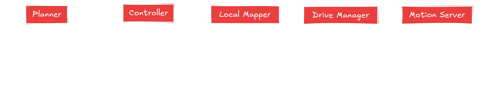
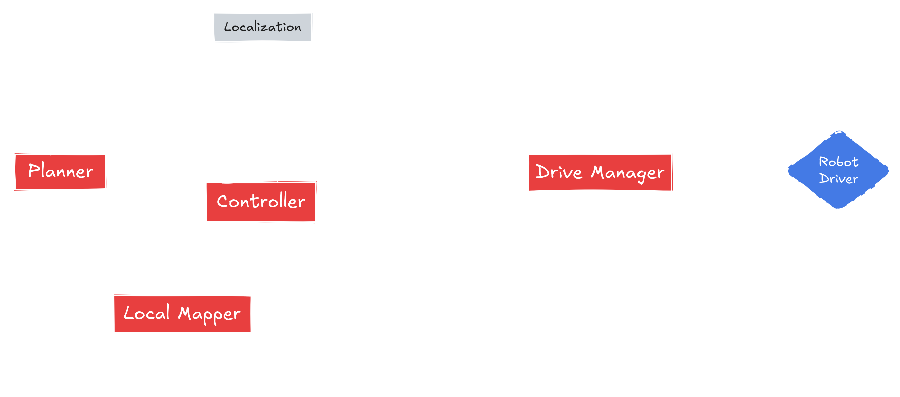

<div align="center">

<picture>
  <source media="(prefers-color-scheme: dark)" srcset="_static/Kompass_dark.png">
  <source media="(prefers-color-scheme: light)" srcset="_static/Kompass_light.png">
  
</picture>

<br/>

[EMOS](https://github.com/automatika-robotics/emos) 生态系统的一部分

[](https://opensource.org/licenses/MIT)
[](https://www.python.org/downloads/)
[](https://docs.ros.org/en/humble/index.html)
[](https://discord.gg/B9ZU6qjzND)

**高性能、事件驱动的 ROS 2 导航栈**

[**EMOS 文档**](https://emos.automatikarobotics.com) | [**开发者文档**](https://automatika-robotics.github.io/kompass/) | [**Discord**](https://discord.gg/B9ZU6qjzND)

🇬🇧 [English](../README.md) | 🇯🇵 [日本語](README.ja.md)

</div>

---

## 什么是 Kompass？

**Kompass** 是 [EMOS](https://github.com/automatika-robotics/emos)（Embodied Operating System，具身操作系统）的导航层。Kompass 是一个用于构建**鲁棒**、**事件驱动**的自主移动机器人导航栈的框架。Kompass 具有可定制、可扩展和硬件无关的特点，提供了直观的 Python API，易于集成、扩展和适配各种使用场景。

Kompass 包含**高度优化的、GPU 加速的 C++ 导航算法**，充分利用可用的硬件资源。它支持 **CPU 多线程执行**，并可在**任何 GPU**（Nvidia、AMD 等）上运行，无厂商锁定。最重要的是，Kompass 让您可以在**一个 Python 脚本中**轻松创建和部署复杂的导航能力，而不会牺牲性能或灵活性。

完整文档、教程和配方请访问 [emos.automatikarobotics.com](https://emos.automatikarobotics.com)。

- [**核心特性**](#核心特性)
- [**组件**](#组件)
- [**安装**](#安装)
- [**基准测试结果**](#基准测试结果)
- [**动态 Web UI**](#动态-web-ui)
- [**机器人插件**](#机器人插件)
- [**EMOS 生态系统**](#emos-生态系统的一部分)

---

## 核心特性

- **自适应事件驱动设计**：响应真实世界事件、机器人状态变化和任务更新。定义事件-动作对以在运行时重新配置导航栈，或根据环境上下文无缝切换规划和控制策略。

- **为速度而生**：所有核心算法均以现代 C++ 编写（[kompass-core](https://github.com/automatika-robotics/kompass-core)）。首个明确支持通过 GPGPU 进行 GPU 加速执行的导航框架，在任何硬件上释放高性能，无厂商锁定。

- **ML 模型作为一等公民**：外部事件可由 ML 模型输出驱动，解释传感器数据或用户命令。整个栈可基于 ML 推理重新配置，超越传统的视觉导航场景。

- **Pythonic API，原生速度**：繁重的计算由优化的 C++ 完成，而 Kompass 提供直观的 Python API。快速原型开发并部署高性能系统，无需重写代码。

---

## 组件

Kompass 分为多个交互组件，每个组件负责一个导航子任务：

<div align="center">
<picture>
  <source media="(prefers-color-scheme: dark)" srcset="_static/images/diagrams/system_components_dark.png">
  <source media="(prefers-color-scheme: light)" srcset="_static/images/diagrams/system_components_light.png">
  
</picture>
</div>

每个组件作为 ROS 2 生命周期节点运行，通过话题、服务或动作服务器进行通信：

<div align="center">
<picture>
  <source media="(prefers-color-scheme: dark)" srcset="_static/images/diagrams/system_graph_dark.png">
  <source media="(prefers-color-scheme: light)" srcset="_static/images/diagrams/system_graph_light.png">
  
</picture>
</div>

在 [EMOS 文档](https://emos.automatikarobotics.com) 中了解各组件详情：
[规划器](https://emos.automatikarobotics.com/kompass/navigation/path_planning.html) |
[控制器](https://emos.automatikarobotics.com/kompass/navigation/control.html) |
[局部建图](https://emos.automatikarobotics.com/kompass/navigation/mapper.html) |
[地图服务](https://emos.automatikarobotics.com/kompass/navigation/map_server.html) |
[驱动管理器](https://emos.automatikarobotics.com/kompass/navigation/driver.html) |
[运动服务](https://emos.automatikarobotics.com/kompass/navigation/motion_server.html)

---

## 安装

详细安装说明请参阅 [EMOS 文档](https://emos.automatikarobotics.com)。

### 安装 kompass-core

**GPU 支持（推荐）：**

```bash
curl -sSL https://raw.githubusercontent.com/automatika-robotics/kompass-core/refs/heads/main/build_dependencies/install_gpu.sh | bash
```

**通过 pip 安装（仅 CPU）：**

```bash
sudo apt-get install -y libompl-dev libfcl-dev libpcl-dev && pip install kompass-core
```

### 安装 Kompass

**快速安装（Ubuntu/Debian，ROS 2 Humble+ 或 Jazzy+）：**

```bash
sudo apt install ros-$ROS_DISTRO-kompass
```

**从源码构建（开发者）：**

```bash
mkdir -p kompass_ws/src && cd kompass_ws/src
git clone https://github.com/automatika-robotics/sugarcoat
git clone https://github.com/automatika-robotics/kompass
rosdep update && rosdep install -y --from-paths . --ignore-src
cd .. && colcon build
```

---

## 基准测试结果

以下图表比较了各导航组件的 CPU 与 GPU 性能。详细方法请参阅[基准测试详情](https://github.com/automatika-robotics/kompass-core/blob/main/src/kompass_cpp/benchmarks/README.md)。

### 对数刻度（CPU vs GPU）

<div align="center">
<picture>
  <source media="(prefers-color-scheme: dark)" srcset="https://raw.githubusercontent.com/automatika-robotics/kompass-core/main/docs/benchmark_log_dark.png">
  <source media="(prefers-color-scheme: light)" srcset="https://raw.githubusercontent.com/automatika-robotics/kompass-core/main/docs/benchmark_log_light.png">
  
</picture>
</div>

### 功耗与效率

_效率 = 每焦耳操作数（吞吐量 / 瓦特）。越高越好。_

<div align="center">
<picture>
  <source media="(prefers-color-scheme: dark)" srcset="https://raw.githubusercontent.com/automatika-robotics/kompass-core/main/docs/benchmark_power_dark.png">
  <source media="(prefers-color-scheme: light)" srcset="https://raw.githubusercontent.com/automatika-robotics/kompass-core/main/docs/benchmark_power_light.png">
  
</picture>
</div>

---

## 动态 Web UI

每个 Kompass 配方都会自动生成动态 Web UI。基于 [Sugarcoat](https://github.com/automatika-robotics/sugarcoat) 框架的 FastHTML 构建，无需编写前端代码即可获得即时控制和可视化界面。

<div align="center">
<picture>
  
</picture>
</div>

---

## 机器人插件

编写可在任何机器人上运行的便携式自动化配方，无需修改代码。机器人插件作为应用程序与机器人特定 ROS 2 接口之间的转换层。

- [介绍视频](https://www.youtube.com/watch?v=oZN6pcJKgfY)
- [完整指南](https://sugarcoat.automatikarobotics.com/features/robot_plugins.html)

---

## EMOS 生态系统的一部分

Kompass 是 [EMOS](https://github.com/automatika-robotics/emos)（Embodied Operating System，具身操作系统）中三个核心开源组件之一——面向 Physical AI 的统一编排层：

- **[EmbodiedAgents](https://github.com/automatika-robotics/embodied-agents)**：智能与操作。具有语义记忆和自适应重配置的 ML 模型图。
- **[Kompass](https://github.com/automatika-robotics/kompass)**：导航。GPU 加速的规划与控制。
- **[Sugarcoat](https://github.com/automatika-robotics/sugarcoat)**：鲁棒的事件驱动 ROS 2 系统设计。

编写一次配方，部署到任何机器人，无需修改代码。

---

## 资源

- [EMOS 文档](https://emos.automatikarobotics.com)：教程、配方和使用指南
- [开发者文档](https://automatika-robotics.github.io/kompass/)：扩展、自定义组件、API 参考
- [Discord](https://discord.gg/B9ZU6qjzND)：社区与支持

## 版权与贡献

**Kompass** 由 [Automatika Robotics](https://automatikarobotics.com/) 和 [Inria](https://inria.fr/) 合作开发。

代码基于 **MIT 许可证** 提供。详情请参阅 [LICENSE](../LICENSE)。
Copyright (c) 2024 Automatika Robotics，除非另有明确说明。
