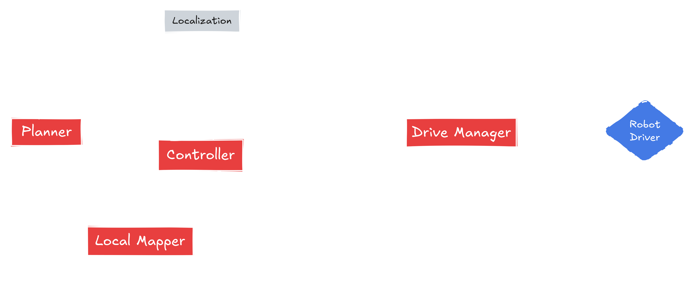

<picture>
  <source media="(prefers-color-scheme: dark)" srcset="_static/Kompass_dark.png">
  <source media="(prefers-color-scheme: light)" srcset="_static/Kompass_light.png">
  
</picture>
<br/>

> 🌐 [English Version](../README.md) | 🇯🇵 [日本語版](README.ja.md)

欢迎使用 Kompass!

Kompass 是目前已知最快、最直观的导航栈！它是一个用于构建**强健**、**事件驱动**的自主移动机器人导航栈的框架。Kompass 具有高度的可定制性、可扩展性，并与硬件平台无关。它提供了一个**直观的 Python API**，便于集成、扩展和适配各种使用场景。

Kompass 内置了**高度优化、基于 GPU 的最先进导航算法的 C++ 实现**，充分利用现有硬件资源。它支持 **CPU 多线程执行**，并且能够在**任何 GPU**（Nvidia、AMD 等）上运行，无需绑定特定厂商。这使得它适用于各种硬件环境的开发与部署。最重要的是，Kompass 让你只需一个 **Python 脚本** 就能轻松创建并部署复杂的移动机器人导航能力，同时保持高性能与灵活性。

- 🛠️[**安装 Kompass**](#安装) 到你的机器人上
- [**为什么选择 Kompass？**](#为什么选择-kompass)
- 查看 Kompass 的[**核心组件概览**](#核心组件)
- 快速上手请查阅[**快速入门教程**](https://automatika-robotics.github.io/kompass/tutorials/quick_start.html) 🚀
- 深入学习请参阅一个[**完整教程**](https://automatika-robotics.github.io/kompass/tutorials/point_navigation.html) 🤖
- 想了解设计理念？点击[**设计概念**](https://automatika-robotics.github.io/kompass/advanced/design.html) 📚

# 为什么选择 Kompass？

- **自适应事件驱动设计**：Kompass 针对真实世界中的事件、机器人状态变化和任务更新做出响应。它的事件驱动架构使得用户可以轻松定义事件-动作对，在运行时动态重构导航栈，或根据环境上下文平滑切换规划/控制策略。

* **为速度而设计 - C++、多线程与跨GPU支持**：所有核心算法均采用现代C++编写，确保执行快速且安全（[kompass-core](https://github.com/automatika-robotics/kompass-core)）。Kompass 是首个显式支持基于GPU执行主要导航组件的导航框架。此外，它内建通用GPU计算（GPGPU）支持，可在任何CPU、GPU甚至FPGA上实现高性能，打破传统框架对特定硬件厂商的依赖。

- **将机器学习模型视为一等公民**：Kompass 中的外部事件可由机器学习模型对传感器数据或用户指令的解读结果驱动，意味着整个导航栈可根据 ML 模型的输出动态重构，超越传统的视觉导航场景。

- **Python 风格 API + 原生速度**：尽管核心计算由 C++ 实现，但 Kompass 提供了直观的 Python API，使开发者能够快速原型开发并部署高性能系统，无需重复编写代码。

- **模块化架构，易于扩展**：Kompass 基于 ROS2，并使用 [Sugarcoat🍬](https://github.com/automatika-robotics/sugarcoat) 进行封装。它将核心算法与 ROS2 接口解耦，确保与不同 ROS2 版本兼容，简化核心升级与社区扩展。

了解更多关于我们创建 Kompass 的[**动机**](https://automatika-robotics.github.io/kompass/why.html)。

# 核心组件

Kompass 由多个交互组件组成，每个组件负责导航任务中的一个子任务：

<picture>
  <source media="(prefers-color-scheme: dark)" srcset="_static/images/diagrams/system_components_dark.png">
  <source media="(prefers-color-scheme: light)" srcset="_static/images/diagrams/system_components_light.png">
  
</picture>

每个组件都作为一个 ROS2 生命周期节点运行，并通过 ROS2 的 topics、services 或 action servers 与其他组件通信：

<picture>
  <source media="(prefers-color-scheme: dark)" srcset="_static/images/diagrams/system_graph_dark.png">
  <source media="(prefers-color-scheme: light)" srcset="_static/images/diagrams/system_graph_light.png">
  
</picture>

了解每个组件的功能与配置，请访问对应的文档页面：

- [路径规划器（Planner）](https://automatika-robotics.github.io/kompass/navigation/path_planning.html)
- [控制器（Controller）](https://automatika-robotics.github.io/kompass/navigation/control.html)
- [驱动管理器（Drive Manager）](https://automatika-robotics.github.io/kompass/navigation/driver.html)
- [运动服务器（Motion Server）](https://automatika-robotics.github.io/kompass/navigation/motion_server.html)

# 安装

## 前置条件

Kompass 需要 ROS2 环境。支持从 _Foxy_ 到 _Rolling_ 的所有 ROS2 版本。请根据[官方文档](https://docs.ros.org/)安装你选择的 ROS2 版本。

## 安装 kompass-core

`kompass-core` 是 Kompass 的 Python 包，提供高度优化的规划与控制算法实现。你可以通过以下方式安装：

### 含 GPU 支持（推荐）：

在任何基于 Ubuntu（包括 Jetpack）的设备上运行：

```bash
curl https://raw.githubusercontent.com/automatika-robotics/kompass-core/refs/heads/main/build_dependencies/install_gpu.sh | bash
```

此脚本将安装所有相关依赖（包括 AdaptiveCPP）并从源码安装最新版本的 kompass-core。建议你先阅读该安装脚本。

### 通过 pip 安装

在 Ubuntu 22.04 或更高版本上，首先安装依赖：

```bash
sudo apt-get install libompl-dev libfcl-dev libpcl-dev
```

### 然后安装 kompass-core：

```bash
pip install kompass-core
```

## 安装 Kompass（二进制包，支持 humble 及以上如 jazzy 等版本）

```bash
sudo apt install ros-$ROS_DISTRO-kompass
```

## 从源码构建 Kompass

```bash
mkdir -p kompass_ws/src
cd kompass_ws/src
git clone https://github.com/automatika-robotics/sugarcoat
git clone https://github.com/automatika-robotics/kompass
rosdep update
rosdep install -y --from-paths . --ignore-src
cd ..
colcon build
```

# 版权声明

除非另有明确说明，本发行版中的代码版权归 Automatika Robotics 所有 © 2024。

Kompass 以 MIT 许可证开源发布。详细信息请参阅 [LICENSE](../LICENSE) 文件。

# 社区贡献

Kompass 由 [Automatika Robotics](https://automatikarobotics.com/) 与 [Inria](https://inria.fr/) 合作开发。我们热烈欢迎来自社区的贡献。
