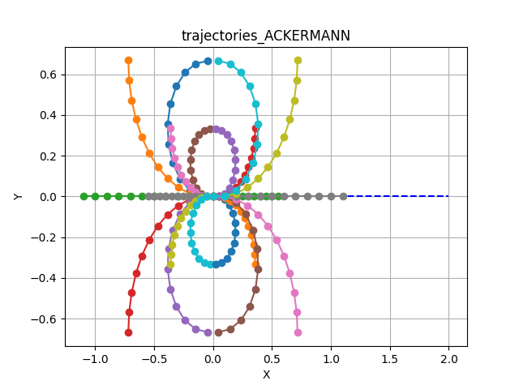
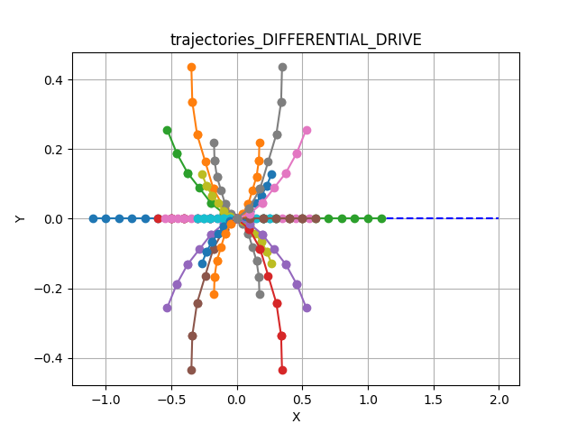
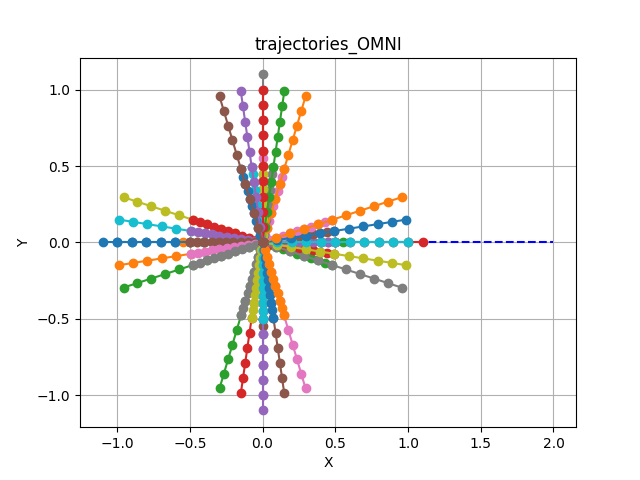

# DWA

**GPU-accelerated Dynamic Window Approach.**

DWA is a classic local planning method developed in the 90s.[^1] It is a sampling-based controller that generates a set of constant-velocity trajectories within a "Dynamic Window" of reachable velocities.

Kompass supercharges this algorithm using **SYCL-based hardware acceleration**, allowing it to sample and evaluate thousands of candidate trajectories in parallel on **Nvidia, AMD, or Intel** GPUs. This enables high-frequency control loops even in complex, dynamic environments with dense obstacle fields.

It is highly effective for differential drive and omnidirectional robots.


## How it Works

The algorithm operates in a three-step pipeline at every control cycle:

- <span class="sd-text-primary" style="font-weight: bold; font-size: 1.1em;">{material-regular}`speed` 1. Search Space</span> - **Compute Dynamic Window.**
  <br>Calculate the range of reachable linear and angular velocities ($v, \omega$) for the next time step, limited by the robot's maximum acceleration and current speed.

- <span class="sd-text-primary" style="font-weight: bold; font-size: 1.1em;">{material-regular}`timeline` 2. Rollout</span> - **Sample Trajectories.**
  <br>Generate a set of candidate trajectories by sampling velocity pairs within the dynamic window and simulating the robot's motion forward in time.

- <span class="sd-text-primary" style="font-weight: bold; font-size: 1.1em;">{material-regular}`grading` 3. Evaluate</span> - **Score & Select.**
  <br>Discard trajectories that collide with obstacles (using **FCL**). Score the remaining valid paths based on distance to goal, path alignment, and smoothness.


<!-- At each step, the reachable velocity range is computed based on the acceleration limits and the motion model of the robot. Then a set of constant velocity trajectories is [sampled](#trajectory-samples-generator) within the range after checking its [admissibility](#admissible-trajectory-criteria). Finally, the best trajectory is selected using the trajectory [cost evaluation](#trajectory-selection) functions. -->


<!-- ## Supported Sensory Inputs

- LaserScan
- PointCloud
- OccupancyGrid -->


## Supported Sensory Inputs

DWA requires spatial data to perform collision checking during the rollout phase.

* <span class="sd-text-primary" style="font-weight: bold; font-size: 1.1em;">{material-regular}`radar` LaserScan</span>
* <span class="sd-text-primary" style="font-weight: bold; font-size: 1.1em;">{material-regular}`grain` PointCloud</span>
* <span class="sd-text-primary" style="font-weight: bold; font-size: 1.1em;">{material-regular}`grid_on` OccupancyGrid</span>


## Parameters and Default Values

```{list-table}
:widths: 10 10 10 70
:header-rows: 1
* - Name
  - Type
  - Default
  - Description

* - control_time_step
  - `float`
  - `0.1`
  - Time interval between control actions (sec). Must be between `1e-4` and `1e6`.

* - prediction_horizon
  - `float`
  - `1.0`
  - Duration over which predictions are made (sec). Must be between `1e-4` and `1e6`.

* - control_horizon
  - `float`
  - `0.2`
  - Duration over which control actions are planned (sec). Must be between `1e-4` and `1e6`.

* - max_linear_samples
  - `int`
  - `20`
  - Maximum number of linear control samples. Must be between `1` and `1e3`.

* - max_angular_samples
  - `int`
  - `20`
  - Maximum number of angular control samples. Must be between `1` and `1e3`.

* - sensor_position_to_robot
  - `List[float]`
  - `[0.0, 0.0, 0.0]`
  - Position of the sensor relative to the robot in 3D space (x, y, z) coordinates.

* - sensor_rotation_to_robot
  - `List[float]`
  - `[0.0, 0.0, 0.0, 1.0]`
  - Orientation of the sensor relative to the robot as a quaternion (x, y, z, w).

* - octree_resolution
  - `float`
  - `0.1`
  - Resolution of the Octree used for collision checking. Must be between `1e-9` and `1e3`.

* - costs_weights
  - `TrajectoryCostsWeights`
  - see [defaults](./cost_eval.md/#configuration-weights)
  - Weights for trajectory cost evaluation.

* - max_num_threads
  - `int`
  - `1`
  - Maximum number of threads used when running the controller. Must be between `1` and `1e2`.

```

```{note}
All the previous parameters can be configured when using DWA algorithm directly in your Python recipe or using a config file (as shown in the usage example)
```

## Usage Example

DWA can be activated by setting the `algorithm` property in the [Controller](../../navigation/control.md) configuration.


```{code-block} python
:caption: dwa.py

from kompass.components import Controller, ControllerConfig
from kompass.robot import (
    AngularCtrlLimits,
    LinearCtrlLimits,
    RobotCtrlLimits,
    RobotGeometry,
    RobotType,
    RobotConfig
)
from kompass.control import ControllersID

# Setup your robot configuration
my_robot = RobotConfig(
    model_type=RobotType.ACKERMANN,
    geometry_type=RobotGeometry.Type.BOX,
    geometry_params=np.array([0.3, 0.3, 0.3]),
    ctrl_vx_limits=LinearCtrlLimits(max_vel=0.2, max_acc=1.5, max_decel=2.5),
    ctrl_omega_limits=AngularCtrlLimits(
        max_vel=0.4, max_acc=2.0, max_decel=2.0, max_steer=np.pi / 3)
)

# Set DWA algorithm using the config class
controller_config = ControllerConfig(algorithm="DWA")

# Set YAML config file
config_file = "my_config.yaml"

controller = Controller(component_name="my_controller",
                        config=controller_config,
                        config_file=config_file)

# algorithm can also be set using a property
controller.algorithm = ControllersID.DWA      # or "DWA"

```

```{code-block} yaml
:caption: my_config.yaml

my_controller:
  # Component config parameters
  loop_rate: 10.0
  control_time_step: 0.1
  prediction_horizon: 4.0
  ctrl_publish_type: 'Array'

  # Algorithm parameters under the algorithm name
  DWA:
    control_horizon: 0.6
    octree_resolution: 0.1
    max_linear_samples: 20
    max_angular_samples: 20
    max_num_threads: 3
    costs_weights:
      goal_distance_weight: 1.0
      reference_path_distance_weight: 1.5
      obstacles_distance_weight: 2.0
      smoothness_weight: 1.0
      jerk_weight: 0.0
```

## Trajectory Samples Generation


Trajectory samples are generated using a constant velocity generator for each velocity value within the reachable range to generate the configured maximum number of samples (see `max_linear_samples` and `max_angular_samples` in the [config parameters](#parameters-and-default-values)).

The shape of the sampled trajectories depends heavily on the robot's kinematic model:

::::{tab-set}

:::{tab-item} Ackermann
:sync: ackermann

**Car-Like Motion**


Note the limited curvature constraints typical of car-like steering.


:::

:::{tab-item} Differential
:sync: diff

**Tank/Diff Drive**


Includes rotation-in-place (if configured) and smooth arcs.


:::

:::{tab-item} Omni
:sync: omni

**Holonomic Motion**


Includes lateral (sideways) movement samples.


:::
::::

:::{admonition} Rotate-Then-Move
:class: note
To ensure natural movement for Differential and Omni robots, Kompass implements a **Rotate-Then-Move** policy. Simultaneous rotation and high-speed linear translation is restricted to prevent erratic behavior.
:::

## Best Trajectory Selection

A collision-free admissibility criteria is implemented within the trajectory samples generator using [FCL](../../integrations/fcl.md) to check the collision between the simulated robot state and the reference sensor input.

Once admissible trajectories are sampled, the **Best Trajectory** is selected by minimizing a weighted cost function:

You can tune these weights (`costs_weights`) to change the robot's behavior (e.g., sticking closer to the path vs. prioritizing obstacle clearance).

:::{button-link} cost_eval.html
:color: primary
:ref-type: doc
:outline:
Learn more about Cost Evaluation →
:::


[^1]: [Dieter Foxy, Wolf Burgardy and Sebastian Thrun. The Dynamic Window Approach to Collision Avoidance. IEEE Robotics & Automation Magazine ( Volume: 4, Issue: 1, March 1997)](https://www.ri.cmu.edu/pub_files/pub1/fox_dieter_1997_1/fox_dieter_1997_1.pdf)
