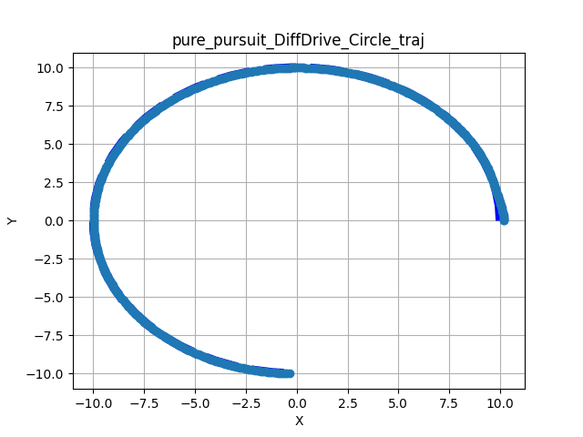

# Pure Pursuit

Pure Pursuit is a path-tracking algorithm that calculates the curvature required to move a robot from its current position to a specific "lookahead" point on a predefined path. By constantly moving the lookahead point forward as the robot progresses, the algorithm creates a smooth, continuous steering command.

Kompass implementation builds upon the base algorithm (as described by [Purdue SIGBOTS](https://wiki.purduesigbots.com/software/control-algorithms/basic-pure-pursuit)) and adds an integrated **Simple Search Collision Avoidance** layer. This allows the robot to deviate slightly from the nominal path or stop if an obstacle is detected within its predicted future trajectory.

---

## Algorithm Overview

1.  **Find Lookahead:** Locates the point on the path that is a distance $L$ (Lookahead Distance) away from the robot.
2.  **Calculate Curvature:** Computes the arc required to reach that point using the robot's kinematics.
3.  **Collision Check:** Projects the robot's motion forward using the `prediction_horizon`.
4.  **Avoidance Search:** If a collision is imminent, the controller evaluates `max_search_candidates` to find a safe velocity offset that clears the obstacle.

## Supported Sensory Inputs

- Without any sensor input (pure following)
- LaserScan
- PointCloud
- Occupancy Maps

---

## Parameters and Default Values

```{list-table}
:widths: 15 10 10 65
:header-rows: 1
* - Name
  - Type
  - Default
  - Description

* - lookahead_gain_forward
  - `float`
  - `0.8`
  - Factor to scale lookahead distance by current velocity ($L = k \cdot v$).

* - prediction_horizon
  - `int`
  - `10`
  - Number of future steps used to check for potential collisions along the path.

* - path_search_step
  - `float`
  - `0.2`
  - Offset step used to search for alternative velocity commands when the nominal path is blocked.

* - max_search_candidates
  - `int`
  - `10`
  - Maximum number of search iterations to find a collision-free command.
```

## Usage Example:

Pure Pursuit controller can be used in the [Controller](../../navigation/control.md) component by setting 'algorithm' property or component config parameter. The Controller will configure Pure Pursuit algorithm using the default values of all the previous configuration parameters. The specific algorithms parameters can be configured using a config file or the algorithm's configuration class.


```{code-block} python
:caption: pure_pursuit.py

from kompass.components import Controller, ControllerConfig
from kompass.robot import (
    AngularCtrlLimits,
    LinearCtrlLimits,
    RobotCtrlLimits,
    RobotGeometry,
    RobotType,
    RobotConfig
)
from kompass.control import ControllersID, PurePursuitConfig

# Setup your robot configuration
my_robot = RobotConfig(
    model_type=RobotType.OMNI,
    geometry_type=RobotGeometry.Type.BOX,
    geometry_params=np.array([0.3, 0.3, 0.3]),
    ctrl_vx_limits=LinearCtrlLimits(max_vel=0.2, max_acc=1.5, max_decel=2.5),
    ctrl_omega_limits=AngularCtrlLimits(
        max_vel=0.4, max_acc=2.0, max_decel=2.0, max_steer=np.pi / 3)
)

# Initialize the controller
controller = Controller(component_name="my_controller")

# Set the all algorithms desired configuration
pure_pursuit_config = PurePursuitConfig(
        lookahead_gain_forward=0.5, prediction_horizon=8, max_search_candidates=20
    )

controller.algorithms_config = pure_pursuit_config

# NOTE: We can configure more than one algorithm to switch during runtime
# other_algorithm_config = ....
# controller.algorithms_config = [pure_pursuit_config, other_algorithm_config]

# Set the algorithm to Pure Pursuit
controller.algorithm = ControllersID.PURE_PURSUIT

```

## Testing and Results

The following figures show the results of testing the Pure Pursuit implementation across the three primary motion models. The tests evaluate the controller's ability to track a reference path while handling unexpected obstacles along the path.

The results visualize the resulting trajectory of the robot (**wide light blue**) against the reference path (**thin dark blue**) in the XY plane. Obstacles are marked with **red x**.

### Tracking a Reference Path

These tests demonstrate the nominal tracking performance on standard geometric paths (U-Turns and Circles) without environmental interference.

| Ackermann (U-Turn) | Differential (Circle) | Omni (Circle) |
| :---: | :---: | :---: |
|  |  |  |

**Figure 1:** Nominal tracking results across different kinematic models.

---

### Tracking with Collision Avoidance

In these scenarios, a set of static obstacles were placed directly on the global path. The controller utilizes the `prediction_horizon` to detect these obstacles and searches for a safe velocity command that deviates from the reference path.

| Ackermann (Straight + Obstacles) | Differential (U-Turn + Obstacles) | Omni (Straight + Obstacles) |
| :---: | :---: | :---: |
|  |  |  |

**Figure 2:** Collision avoidance results showing local deviation to clear obstacles.


### Observations

* **Convergence:** All models show smooth convergence to the reference path.
* **Obstacle Clearance:** The simple search algorithm successfully identifies clear paths around obstacles. The robot returns to the reference path after clearing the obstacle boundary.
* **Stability:** The integration of the collision checker does not introduce oscillations in the steering command.
