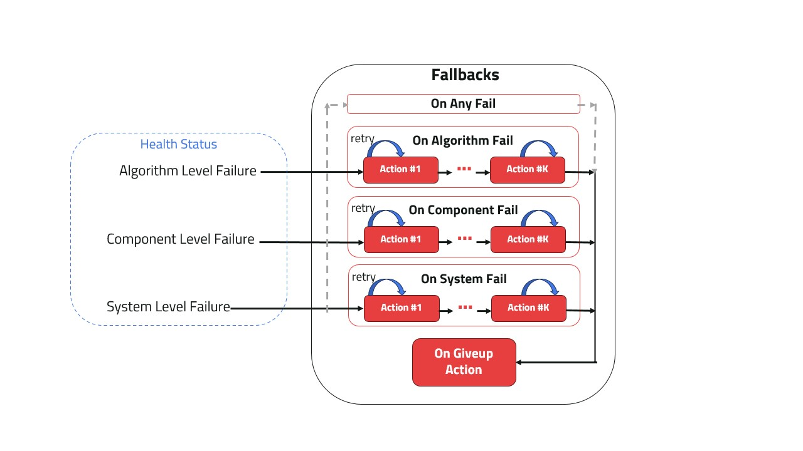

# Fallbacks

 Components Fallbacks contain the set of [Actions](actions.md) to be executed when a failure [status](status.md) is detected. Fallbacks are defines with an Action or a list of Actions to be executed in sequence. Each Action in the list is retried until max_retries is reached.

:::{figure-md} fig-fallbacks



Fallbacks and Health Status
:::

## Fallbacks Categories:

Each component has 3 built-in possible fallbacks categories along with the possibility to set a behavior for "any failure" and a "giveup" behavior that is executed when all failure actions are exhausted.

- on_component_fail
- on_algorithm_fail
- on_system_fail
- on_any_fail
- on_giveup


The first three are designed to correspond to the three different [Health Status](status.md) a Component can take other than "Healthy" status. 'on_any_fail' is used to define a fallback policy regardless of the failure category. Finally, 'on_give' is the final Action the Component will execute when all the fallbacks and retries are exhausted.


## Default behavior in a Component:

The default behavior in a Component is for the component to broadcast the status on any detected failure. By default the component sets 'on_any_fail' Fallback to 'Action(self.broadcast_status)' with 'max_retries=None'.

Action(s) set for 'on_any_fail' is executed for *any* failure for which no fallback action is defined.

:::{note} Each Component already owns its own ComponentFallback configured to the previous default behavior. The only thing required is to configure the Actions executed at each (or any) failure type.
:::


## Usage in a Component:
```python
    from kompass.components.component import Component
    from kompass.actions import Actions

    my_component = Component(node_name='test_component')

    # Set fallback for component failure to restart the component
    my_component.on_component_fail(fallback=Actions.restart(component=my_component))

    # Change fallback for any failure
    my_component.on_fail(fallback=Action(my_component.restart))

    # First broadcast status, if another failure happens -> restart
    my_component.on_fail(fallback=[Action(my_component.broadcast_status), Action(my_component.restart)])
```
