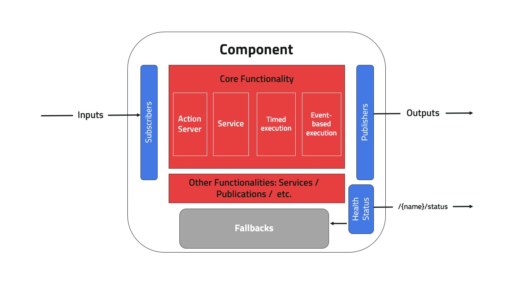
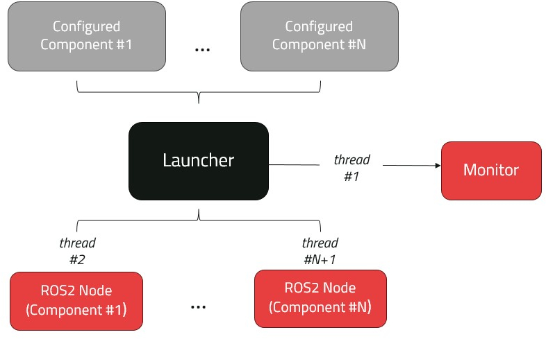
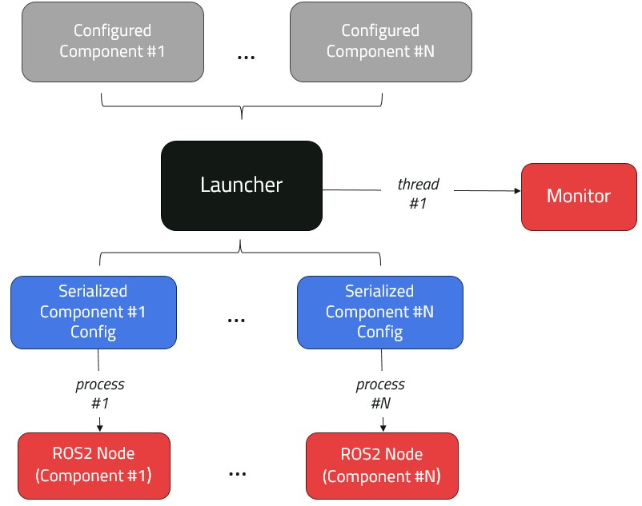

# Design Concepts

[Component](component.md) is the main execution unit in Kompass, each component is configured with [Inputs/Outputs](topics.md) and [Fallback](fallbacks.md) behaviors. Additionally, each component updates its own [Health Status](status.md). Components can be handled and reconfigured dynamically at runtime using [Events](events.md) and [Actions](actions.md). Events, Actions and Components are passed to the [Launcher](launcher.md) which runs the set of components as using multi-threaded or multi-process execution. The Launcher also uses an internal [Monitor](monitor.md) to keep track of the components and monitor events.

:::{figure-md} fig-comp



Component Structure
:::

:::{figure-md} fig-multi-thread



Multi-threaded execution
:::

:::{figure-md} fig-multi-process



Multi-process execution
:::
<!-- # Design Concepts -->

```{toctree}
:maxdepth: 1
:caption: Design Concepts

component
topics
status
events
actions
fallbacks
launcher
monitor
```
