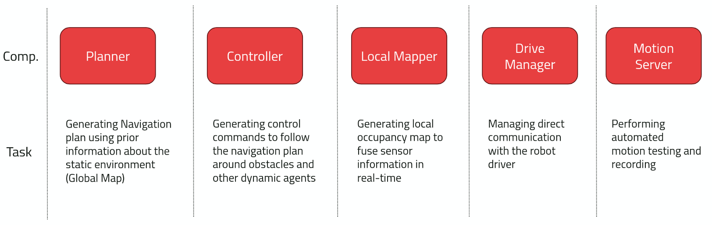
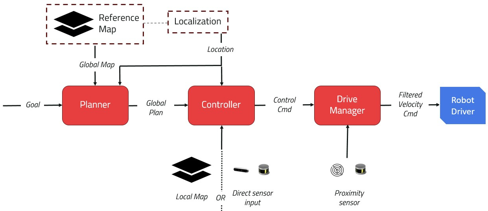

# Navigation Components


Kompass is divided into several interacting components each responsible for one of the navigation subtasks:

:::{figure-md} fig-components-tasks



Kompass Components and Main Tasks
:::

Each of the previous components runs as a ROS2 lifecycle node and communicates with the other components using ROS2 topics, services or action servers:

:::{figure-md} fig-components-system



Kompass Full System for Autonomous Navigation
:::


```{toctree}
:maxdepth: 1
:caption: Navigation Components

robot
path_planning
control
driver
mapper
motion_server
mapping_localization
```
