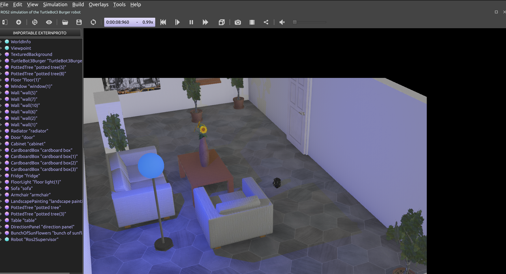
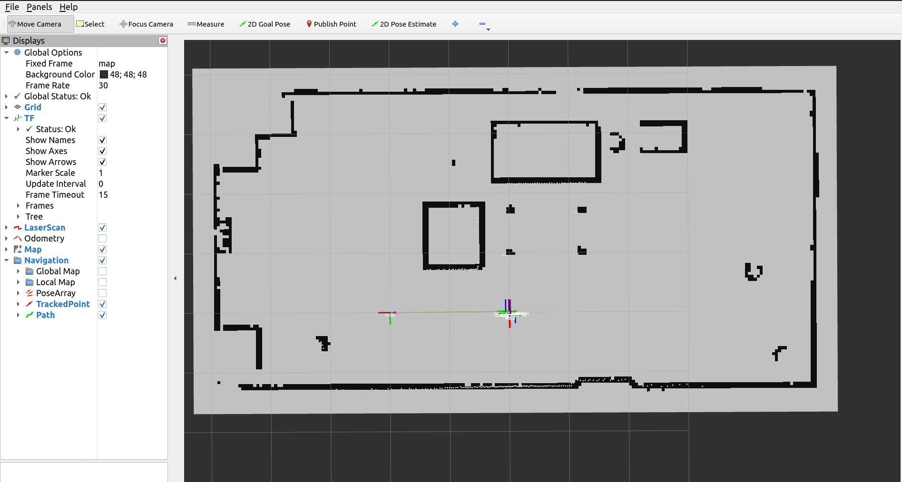

# Quick Start

Here we provide a quick recipe to get started with Kompass. The recipe is a single python script to build a complete navigation system. We will test the recipe in simulation. Lets first see how we can run the recipe and then we will go through it step by step.

## Run the recipe

To quickly launch the [recipe](https://github.com/automatika-robotics/kompass-ros/tree/dev/kompass_ros/recipes) using Kompass we use a simulation of the [Turtlebot3](https://emanual.robotis.com/docs/en/platform/turtlebot3/overview/#notices) robot in [Webots](https://github.com/cyberbotics/webots_ros2) simulator.

- Install turtlebot3 and webots ROS2 packages:

```shell
sudo apt install ros-${ROS_DISTRO}-webots-ros2 ros-${ROS_DISTRO}-rviz2
```

- Install map server and localization packages:

```shell
sudo apt install ros-${ROS_DISTRO}-nav2-map-server ros-${ROS_DISTRO}-robot-localization
```

- Launch the simulation:

```shell
ros2 launch kompass webots_turtlebot3_launch.py
```

This will start webots simulator, Rviz and the robot localization and map server:

:::{figure-md} fig-webots



Webots Tutrlebot3 Simulation
:::

:::{figure-md} fig-rviz


Rviz
:::

- Open a new terminal and launch our recipe:

```shell
ros2 run kompass turtlebot3_test
```

## Step-by-Step Tutorial

### Step 1: Setup your robot

The first step to start navigating is to configure the robot the will use the navigation system. Kompass provides a `RobotConfig` primitive where you can add the robot motion model (ACKERMANN, OMNI, DIFFERENTIAL_DRIVE), the robot geometry parameters and the robot control limits. Lets see how that looks like in code.

```python
import numpu as np
from kompass_core.models import (
    AngularCtrlLimits,
    LinearCtrlLimits,
    RobotGeometry,
    RobotType,
)
from kompass.config import RobotConfig

# Setup your robot configuration
my_robot = RobotConfig(
    model_type=RobotType.DIFFERENTIAL_DRIVE,
    geometry_type=RobotGeometry.Type.CYLINDER,
    geometry_params=np.array([0.1, 0.3]),
    ctrl_vx_limits=LinearCtrlLimits(max_vel=0.2, max_acc=1.5, max_decel=2.5),
    ctrl_omega_limits=AngularCtrlLimits(
        max_vel=0.4, max_acc=2.0, max_decel=2.0, max_steer=np.pi / 3
    ),
)
```

Above we have configured the robot to be a differential drive robot (which is the Turtlebot3 motion model) and approximated the geometry of the robot with a cylinder of dimensions $(Radius = 0.1m, Height = 0.3m)$. The control limits are configured only for the linear (forward) velocity $v_x$ and the angular velocity $\omega$, as the robot has no lateral $v_y$ movement.

Next we need to provide the robot $TF$ frame names:

```python
from kompass.config import RobotFrames

robot_frames = RobotFrames(
    robot_base='base_link',
    odom='odom',
    world='map',
    scan='LDS-01'
)
```

```{seealso}
You can learn more [here](navigation/robot.md) about the available robot configurations in Kompass.
```

```{note}
You can also pass the same previous configuration using a YAML file. See an example in [turtulebot3.yaml](https://github.com/automatika-robotics/kompass/blob/main/kompass/params/turtlebot3.yaml)
```

### Step 2: Setup your stack components

Kompass components come with pre-configured default values for all the parameters, algorithms and inputs/outputs. To get the default configuration you simply need to provide a name to each component (the ROS2 node name). In this recipe, we will setup the minimal configuration required to run the stack with the Turtlebot3. We set the Planner goal_point input to the `clicked_point` topic on Rviz, and set the Driver output to the Turtlebot3 command.

```python
from kompass.components import (
    Controller,
    Planner,
    PlannerConfig,
    Driver
)
from kompass.topic import Topic

# Setup components with default config, inputs and outputs
planner_config = PlannerConfig(loop_rate=1.0)       # 1 Hz
planner = Planner(component_name="planner", config=planner_config)

# Set Planner goal input to Rviz Clicked point
goal_topic = Topic(name="/clicked_point", msg_type="PointStamped")
planner.inputs(goal_point=goal_topic)

# Get a default controller component
controller = Controller(component_name="controller")

# Set DriveManager velocity output to the turtlebot3 twist command
driver = DriveManager(component_name="drive_manager")
driver.outputs(command=Topic(name="cmd_vel", msg_type="Twist"))
```

```{seealso}
Several other configuration options are available for each component, refer to the [Planner](./navigation/path_planning.md) and [Controller](./navigation/control.md) dedicated pages for more details.
```

### Step 3: Setup your Launcher

The launcher in Kompass is a wrapper for ROS2 launch tools. Launcher requires a Component or a set of Components to start. Launcher can also manage Events/Actions which we will leave out of this simple example (check a more advanced example [here](tutorials/events_actions.md)).

After initializing the Launcher with the required components, we also pass the robot configuration and frames to the launcher (which will be forwarded to all the components). We will also set two other parameters; we set 'activate_all_components_on_start' to `True` so all the components will transition to 'active' state after bringup. We also set 'multi_processing' to `True` to start each component in a separate process.


```python
from kompass.launcher import Launcher


# Init a launcher
launcher = Launcher()

# Pass kompass components to the launcher
launcher.kompass(
    components=[planner, controller, driver],
    activate_all_components_on_start=True,
    multi_processing=True,
)

# Set the robot configuration
launcher.robot = robot_config

# Set the frames
launcher.frames = frames_config

# Fallback Policy: If any component fails -> restart it with unlimited retries
launcher.on_fail(action_name="restart")

# After all configuration is done bringup the stack
launcher.bringup()
```

Notice that in the above code we also set a generic fallback policy to restart any failed components.

```{seealso}
There are various fallback mechanisms available in Kompass. Learn more about them [here](design/fallbacks.md).
```

```{seealso}
To pass other components to the launcher from packages other than Kompass, use the method `add_pkg`. See more details in [ROS Sugar](link) about creating your own package and using it with the Launcher.
```

Finally, we bring up our stack and select the desired logging level.

Et voila! we have a navigation system ready to run in less than 70 lines of code!

```{code-block} python
:caption: turtlebot3 test
:linenos:

import numpu as np
from kompass_core.models import (
    AngularCtrlLimits,
    LinearCtrlLimits,
    RobotGeometry,
    RobotType,
)
from kompass.config import RobotConfig, RobotFrames
from kompass.components import (
    Controller,
    DriveManager,
    Planner,
    PlannerConfig,
)
from kompass.launcher import Launcher
from kompass.topic import Topic

# Setup your robot configuration
my_robot = RobotConfig(
    model_type=RobotType.DIFFERENTIAL_DRIVE,
    geometry_type=RobotGeometry.Type.CYLINDER,
    geometry_params=np.array([0.1, 0.3]),
    ctrl_vx_limits=LinearCtrlLimits(max_vel=0.2, max_acc=1.5, max_decel=2.5),
    ctrl_omega_limits=AngularCtrlLimits(
        max_vel=0.4, max_acc=2.0, max_decel=2.0, max_steer=np.pi / 3
    ),
)

# Set the robot frames
robot_frames = RobotFrames(
    robot_base='base_link',
    odom='odom',
    world='map',
    scan='LDS-01'
)

# Setup components with default config, inputs and outputs
planner_config = PlannerConfig(loop_rate=1.0)       # 1 Hz
planner = Planner(component_name="planner", config=planner_config)

# Set Planner goal input to Rviz Clicked point
goal_topic = Topic(name="/clicked_point", msg_type="PointStamped")
planner.inputs(goal_point=goal_topic)

# Get a default controller component
controller = Controller(component_name="controller")

# Set DriveManager velocity output to the turtlebot3 twist command
driver = DriveManager(component_name="drive_manager")
driver.outputs(command=Topic(name="cmd_vel", msg_type="Twist"))

# Init a launcher
launcher = Launcher()

# Pass kompass components to the launcher
launcher.kompass(
    components=[planner, controller, driver],
    activate_all_components_on_start=True,
    multi_processing=True,
)

# Set the robot
launcher.robot = robot_config

# Set the frames
launcher.frames = frames_config

# Fallback Policy: If any component fails -> restart it with unlimited retries
launcher.on_fail(action_name="restart")

# After all configuration is done bringup the stack
launcher.bringup()
```
