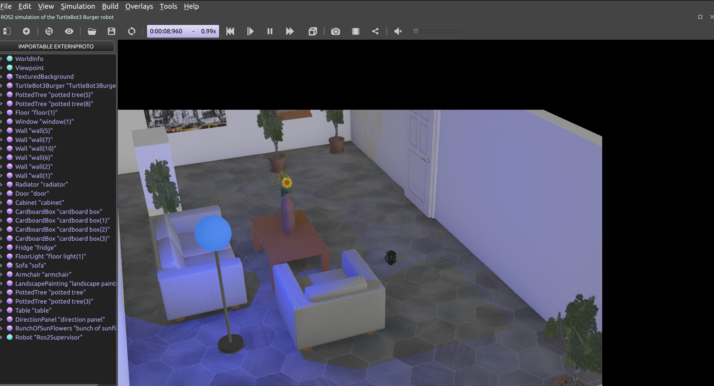

# Quick Start (Webots Simulator)

Here we provide a quick recipe to get started with Kompass using [Webots](https://github.com/cyberbotics/webots_ros2) simulator. The recipe is a single python script to build a point navigation system. Lets first see how we can launch the simulation and run the recipe and then we will go through it step by step.

## Install the dependencies and launch the simulation

For an easy start with Kompass we created a separate simulation package ([kompass_sim](https://github.com/automatika-robotics/kompass-sim)) with ready-to-launch examples created to test 2D navigation using few popular robot simulators. In this example we will use a simulation of the [Turtlebot3](https://emanual.robotis.com/docs/en/platform/turtlebot3/overview/#notices) robot in [Webots](https://github.com/cyberbotics/webots_ros2) simulator.

```{note}
All the required simulation dependencies are found in `kompass-sim` and can be installed with `rosdep`
```

- Start by cloning and building `kompass_sim` from source, see the instructions [here](https://github.com/automatika-robotics/kompass-sim/blob/main/README.md)

- Now you can launch the simulation by simply running:

```shell
ros2 launch kompass_sim webots_turtlebot3.launch.py
```

This will start Webots simulator, Rviz, the robot localization node and the map server:

:::{figure-md} fig-webots



Webots Tutrlebot3 Simulation
:::

:::{figure-md} fig-rviz


Rviz
:::

```{note}
If Webots simulator is not already installed, an installation prompt will appear on the first run of the previous script
```

## Run the recipe


- Open a new terminal and launch our recipe:

```shell
ros2 run kompass turtlebot3_test
```

```{note}
Depending on your Webots version, the robot's low-level controller can expect either a `Twist` control message or a `TwistStamped` message (for newer versions). To use the previous recipe with `TwistStamped`, all you need to do is edit the recipe params file to [assign the `TwistStamped` message type to the `robot_command` output of the driver](https://github.com/automatika-robotics/kompass/blob/main/kompass/params/turtlebot3.toml#L22). You also need to set the localization node to [use stamped control](https://github.com/automatika-robotics/kompass-sim/blob/main/params/turtlebot3_localization.yaml#L197).
```

Now, we'll break the recipe down step by step 👇

<br/>

```{include} point_navigation.md
```
