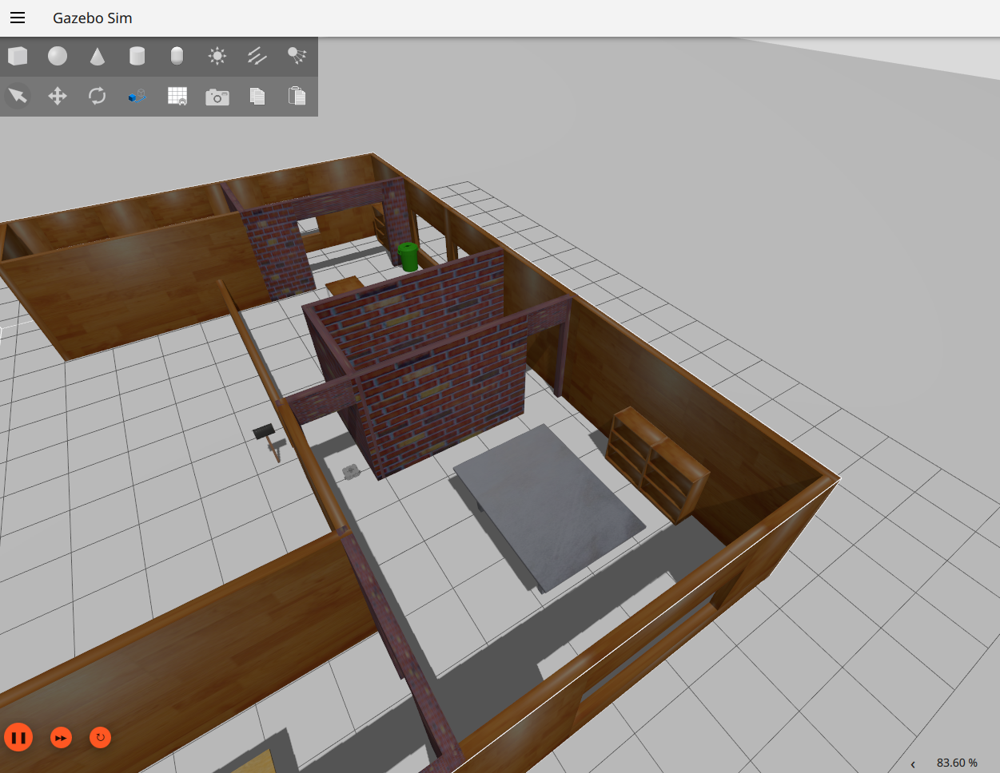
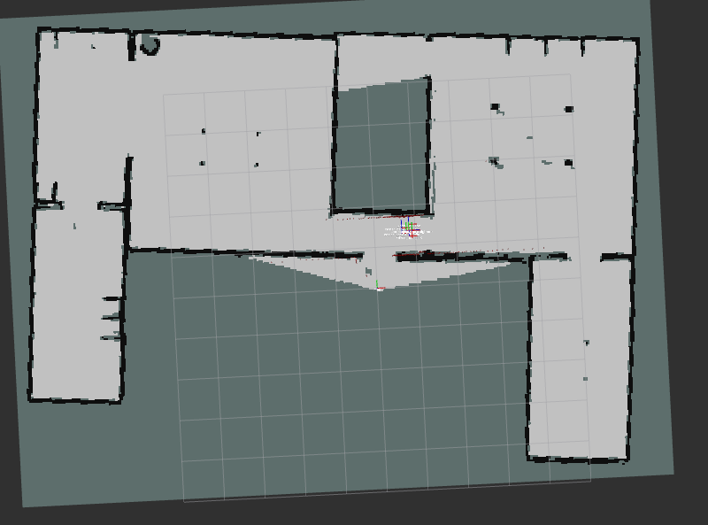

# Quick Start (Gazebo Simulator)

Here we provide a quick recipe to get started with Kompass using [Gazebo](https://gazebosim.org/docs/latest/getstarted/) simulator. The recipe is a single python script to build a point navigation system. Lets first see how we can launch the simulation and run the recipe and then we will go through it step by step.

## Install Gazebo

The most recommended way to [install Gazebo](https://gazebosim.org/docs/latest/install/) is by installing its default version available from the ROS repository when installing `ros-gz`. To install `ros-gz` run the following command by replace ${ROS_DISTRO} with your ROS distribution (e.g. `humble`, `rolling`, etc).

```shell
sudo apt-get install ros-${ROS_DISTRO}-ros-gz
```

## Launch the simulation

For an easy start with Kompass we created a separate simulation package ([kompass_sim](https://github.com/automatika-robotics/kompass-sim)) with ready-to-launch examples created to test 2D navigation using few popular robot simulators. In this example we will use a simulation of the [Turtlebot3](https://emanual.robotis.com/docs/en/platform/turtlebot3/overview/#notices) robot in a pre-built house environment in Gazebo.

```{note}
All the required simulation dependencies are found in `kompass-sim` and can be installed with `rosdep`
```

- Start by cloning and building `kompass_sim` from source, see the instructions [here](https://github.com/automatika-robotics/kompass-sim/blob/main/README.md)

- Set the used Turtlebot3 model in Gazebo as an environment variable:

```shell
export TURTLEBOT3_MODEL=waffle_pi
```

- Now you can launch the simulation by simply running:

```shell
ros2 launch kompass_sim gazebo_turtlebot3_house.launch.py
```

This will start Gazebo simulator, Rviz, the robot localization node and the map server:

:::{figure-md} fig-gz-sim



Gazebo Tutrlebot3 Simulation
:::

:::{figure-md} fig-gz-rviz


Gazebo Tutrlebot3 Simulation - Rviz
:::


## Run the recipe


- Open a new terminal and launch our recipe:

```shell
ros2 run kompass turtlebot3_test
```

## Test sending Goals

You can now send navigation goals to Kompass by using the `clicked_point` directly on Rviz.

Now, lets keep going and break the `turtlebot3_test` [recipe step by step](point_navigation.md) 👇

## 👉 [Point Navigation Recipe](point_navigation.md)
